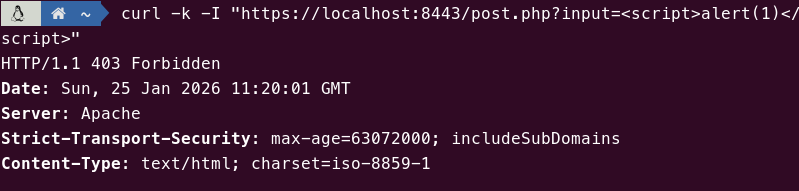
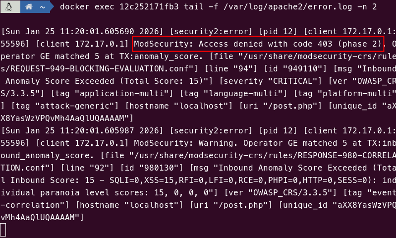

# Tarea 1.2

Esta tarea continua implementando el hardening en Apache. Ahora se requiere el despliegue de un WAF (Web Application Firewall) mediante el módulo mod_security2.

## Explicación

En primer lugar se instala el paquete mod_security y, dado que también se pide que probemos el funcionamiento sirviendo un fichero PHP, también instalamos el paquete php y la librería mod-php, que hace de puente entre Apache y el intérprete de PHP, permitiendo que Apache pueda ejecutar este tipo de scripts.

```docker
RUN apt-get update && \
    apt-get install -y libapache2-mod-security2 php libapache2-mod-php && \
    apt-get clean
```

Para que el WAF funcione, utilizamos un dichero de configuración `/etc/modsecurity/modsecurity.conf` basado en la configuración que viene de ejemplo.

La configuración que el fichero trae de serie solo detecta cuando hay match con una norma, así que ase cambia la directiva `SecRuleEngine` a `On`.

```yaml
SecRuleEngine On
```

Por último, copiamos el fichero `post.php` a la imagen para poder probar el funcionamiento del WAF.

```docker
COPY post.php /var/www/html/post.php
```

## Pull

```bash
docker pull pps11139483/pps-ra3:ra3_1-tarea-1.2
```

## Ejecución

```bash
docker run --name tarea1.2 -p 8080:80 -p 8443:443 pps11139483/pps-ra3:ra3_1-tarea-1.2
```

## Pruebas y validación

Para probar que el WAF bloquea la ejecución de comandos en una petición `POST`, o bien podemos navegar por `https://localhost:8443/post.php` e introducir el texto "`<script>alert(1)</script>`", o bien podemos simularlo con el siguiente comando:

**Comando de prueba:**

```bash
curl -k -I "https://localhost:8443/post.php?input=<script>alert(1)</script>"

```

**Output Esperado:**

El servidor debe rechazar la petición inmediatamente con un código **403 Forbidden**, indicando que ModSecurity ha detectado el patrón malicioso y ha cerrado la conexión.

```http
HTTP/1.1 403 Forbidden
Server: Apache
Content-Type: text/html; charset=iso-8859-1
Strict-Transport-Security: max-age=63072000; includeSubDomains

```

## Capturas

> Conexión **rechazada** por ModSecurity con código `403`.<br>


> Evento capturado en los **logs de error** de Apache..<br>


## Fuentes

- [Hardening del Servidor](https://psegarrac.github.io/Ciberseguridad-PePS/tema3/seguridad/web/2021/03/01/Hardening-Servidor.html#apache-extra)
- [Linode - How to Secure Apache 2 with ModSecurity](https://linode.com/docs/guides/securing-apache2-with-modsecurity)
- [Fichero post.php (fuente original)](https://github.com/victorponz/Ciberseguridad-PePS/blob/master/php/validacion/post.php)