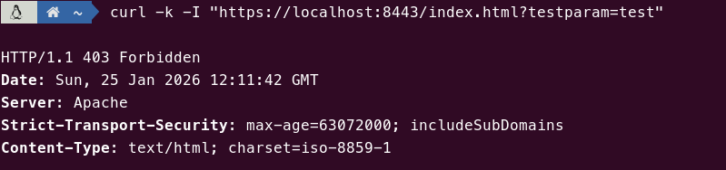
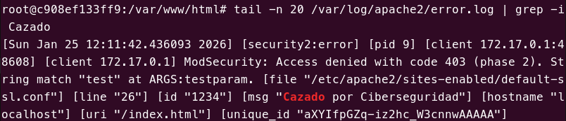
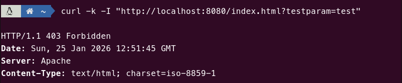
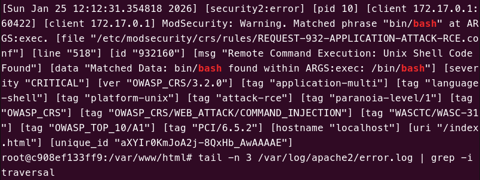
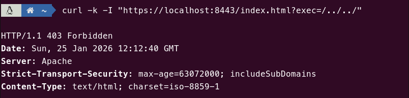
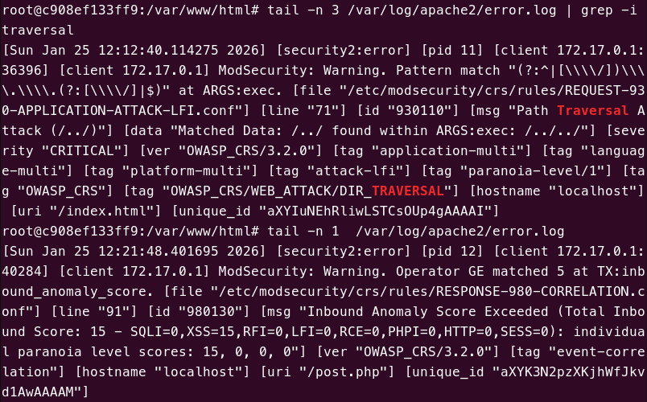
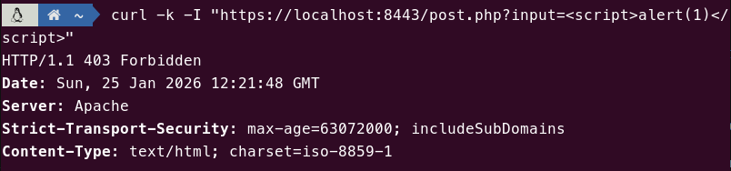
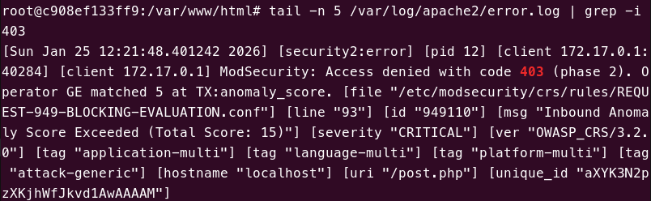

# Tarea 1.3

Esta tarea se basa en la anterior (Tarea 1.2), mejorando la configuración del WAF mediante la instalación de las **Core Rule Set de OWASP (OWASP ModSecurity CRS)**, que son un conjunto de reglas completas y mantenidas por la comunidad para proteger contra vulnerabilidades web comunes.

## Explicación

En primer lugar, instalamos Git para poder clonar el repositorio de OWASP. Desinstalamos las reglas CRS que trae modsecurity de serie, puesto que queremos clonar el repositorio oficial para disponer de las reglas actualizadas.

```docker
RUN apt-get update && \
    apt-get install -y git && \
    apt-get remove -y modsecurity-crs || true && \
    apt-get clean
```

Posteriormente, descargamos las reglas OWASP CRS desde el repositorio oficial de SpiderLabs:

```docker
WORKDIR /tmp
RUN git clone https://github.com/SpiderLabs/owasp-modsecurity-crs.git
```

A continuación, movemos las reglas descargadas al directorio de configuración de ModSecurity y copiamos la configuración base de las CRS:

```docker
RUN mkdir -p /etc/modsecurity/crs/rules && \
    cp -r owasp-modsecurity-crs/rules/* /etc/modsecurity/crs/rules && \
    mv owasp-modsecurity-crs/crs-setup.conf.example /etc/modsecurity/crs/crs-setup.conf && \
    rm -rf owasp-modsecurity-crs
```

> Nota: Si no hubiéramos desinstalado el paquete `modsecurity-crs` nos daría errores al ejecutar el contenedor por conflicto de ids de reglas duplicadas.


Luego, incluimos las reglas OWASP en la configuración de ModSecurity de Apache:

```yaml
    IncludeOptional /etc/modsecurity/*.conf
    Include /etc/modsecurity/crs/crs-setup.conf
    Include /etc/modsecurity/crs/rules/*.conf
```

Finalmente, añadimos una regla personalizada que bloquea peticiones donde el parámetro `testparam` contiene la palabra "test":

```yaml
SecRule ARGS:testparam "@contains test" "id:1234,phase:2,deny,status:403,msg:'Cazado por Ciberseguridad'"
```

Esta regla se aplica tanto al sitio seguro `default-ssl.conf` como al sitio http `000-default.conf`.

## Pull

```bash
docker pull pps11139483/pps-ra3:ra3_1-tarea-1.3
```

## Ejecución

```bash
docker run --name tarea1.3 -p 8080:80 -p 8443:443 pps11139483/pps-ra3:ra3_1-tarea-1.3
```

## Pruebas y validación

Debemos validar tanto la regla personalizada como las reglas generales de OWASP.

### Prueba de Regla Personalizada

Esta prueba dispara la regla ID 1234 que hemos añadido manualmente.

**Comando:**

```bash
curl -k -I "https://localhost:8443/index.html?testparam=test"
```

**Output Esperado:**

```html
 `HTTP/1.1 403 Forbidden` (Mensaje interno: "Cazado por Ciberseguridad").
```

### Prueba OWASP: Command Injection

Esta prueba verifica que las reglas CRS detectan intentos de ejecutar comandos de shell.

**Comando:**

```bash
curl -k -I "https://localhost:8443/index.html?exec=/bin/bash"
```

**Output Esperado:**

```html
 `HTTP/1.1 403 Forbidden`
```

### Prueba OWASP: Path Traversal

Esta prueba verifica que no se puede intentar acceder a directorios padres.

**Comando:**

```bash
curl -k -I "https://localhost:8443/index.html?exec=/../../"
```

**Output Esperado:**

```html
 `HTTP/1.1 403 Forbidden`
```

### Prueba de inyección de comandos en POST

El objetivo de esta prueba es demostrar que las reglas de la práctica anterior se siguen aplicando.

**Comando de prueba:**

```bash
curl -k -I "https://localhost:8443/post.php?input=<script>alert(1)</script>"
```

**Output Esperado:**

```html
 `HTTP/1.1 403 Forbidden`
```

## Capturas

A continuación se muestran las capturas de pantalla que demuestran el correcto funcionamiento del Core Rule Set y la regla personalizada.

> Conexión **rechazada** con código de error `403` por la adición de parámetros bloqueados (la regla personalizada).<br>

Log de error.<br>

La regla también funciona en el sitio http:<br>


> Conexión **rechazada** con código de error `403` por bloqueo de ejecución de comandos shell.<br>

Log de error.<br>


> Conexión **rechazada** con código de error `403` por bloqueo de Path Traversal.<br>

Log de error.<br>


> Conexión **rechazada** con código de error `403` por bloqueo de inyección de comandos en POST.<br>

Log de error.<br>


## Fuentes

- [Hardening del Servidor](https://psegarrac.github.io/Ciberseguridad-PePS/tema3/seguridad/web/2021/03/01/Hardening-Servidor.html#apache-extra)
- [OWASP CRS Project](https:/coreruleset.org)
- [BlackLock - Configuring ModSecurity with OWASP CRS - Part 1](https://www.blacklock.io/post/configuring-modsecurity-with-owasp-crs---part-1)