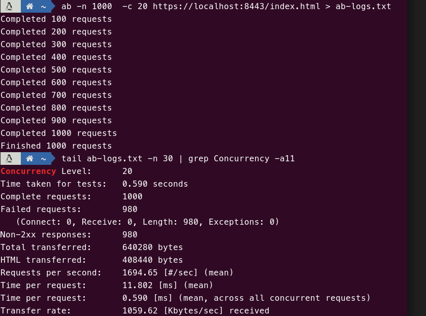
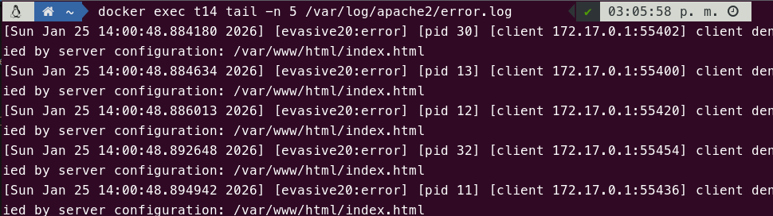

# Tarea 1.4

Esta tarea se basa en la anterior (Tarea 1.3), implementando un **módulo anti-DDoS en Apache mediante mod_evasive**, que protege contra ataques de negación de servicio distribuidos (DDoS) limitando el número de conexiones simultáneas desde una misma IP.

## Explicación

En primer lugar, instalamos el módulo `libapache2-mod-evasive` que proporciona la funcionalidad de protección contra ataques DDoS:

```docker
RUN apt-get update && \
    apt-get install -y libapache2-mod-evasive && \
    apt-get clean
```

A continuación, creamos el directorio donde se almacenarán los logs de las detecciones de mod_evasive y asignamos los permisos adecuados al usuario `www-data`:

```docker
RUN mkdir -p /var/log/mod_evasive && \
    chown -R www-data:www-data /var/log/mod_evasive
```

Luego, copiamos el archivo de configuración personalizado `evasive.conf` que reemplaza la configuración por defecto con umbrales bajos para facilitar la prueba:

```docker
COPY evasive.conf /etc/apache2/mods-available/evasive.conf
```

Finalmente, habilitamos el módulo `mod_evasive` en Apache:

```docker
RUN a2enmod evasive
```

### Configuración de mod_evasive

El archivo `evasive.conf` contiene los siguientes parámetros:

- **DOSHashTableSize**: Tamaño de la tabla hash (3097) que mejora el rendimiento de las búsquedas de IPs.
- **DOSPageCount**: Número máximo de peticiones a la misma página desde la misma IP (2) en el intervalo DOSPageInterval.
- **DOSSiteCount**: Número máximo de peticiones totales desde la misma IP (10) en el intervalo DOSSiteInterval.
- **DOSPageInterval**: Intervalo de tiempo en segundos (1) para contar las peticiones a una página.
- **DOSSiteInterval**: Intervalo de tiempo en segundos (1) para contar las peticiones totales.
- **DOSBlockingPeriod**: Tiempo en segundos (60) durante el cual la IP será bloqueada tras detectar un posible ataque.
- **DOSEmailNotify**: Dirección de correo (root@localhost) donde se enviarán notificaciones.
- **DOSLogDir**: Directorio donde se almacenan los logs de mod_evasive (`/var/log/mod_evasive`).

> Nota: Los umbrales (DOSPageCount, DOSSiteCount) son muy bajos para facilitar las pruebas y simular un ataque DDoS rápidamente.

## Pull

```bash
docker pull pps11139483/pps-ra3:ra3_1-tarea-1.4
```

## Ejecución

```bash
docker run --name tarea1.4 -p 8080:80 -p 8443:443 pps11139483/pps-ra3:ra3_1-tarea-1.4
```

## Pruebas y validación

Para probar el funcionamiento de mod_evasive y verificar que bloquea las conexiones excesivas, hay que generar tráfico de prueba.

Desde otra terminal, ejecuta `ab` (Apache Bench) para generar carga más consistente. Este binario está encluido en el paquete `apache2-utils`.

> Si el binario no está presente en el sistema, se puede conseguir instalando el paquete apache2-utils:

```bash
sudo apt-get update
sudo apt-get install -y apache2-utils
```

Lanzamos el comando apache-bech:
```bash
# 1000 peticiones, 20 a la vez
ab -n 1000 -c 20 https://localhost:8443/index.html
```
**Verificación de los logs:**

Dentro del contenedor, se puede revisar los logs de bloqueo:

```bash
docker exec tarea1.4 tail -n 5 /var/log/apache2/error.log
```

**Output esperado:**

```sh
...
[Sun Jan 25 14:00:48.892648 2026] [evasive20:error] [pid 32] [client 172.17.0.1:55454] client denied by server configuration: /var/www/html/index.html
[Sun Jan 25 14:00:48.894942 2026] [evasive20:error] [pid 11] [client 172.17.0.1:55436] client denied by server configuration: /var/www/html/index.html

```

Mod_evasive también deja un registro de qué IP provocó el bloqueo.

```bash
docker exec tarea1.4 ls /var/log/mod_evasive/
```

**Output esperado:**

```bash
dos-172.17.0.1
```

## Capturas

> Ejecución de `ab`.

[> **Descargar fichero con los logs completos de ejecución de ab**](./ab-logs.txt)

> Registros de bloqueo de apache.


## Fuentes

- [Hardening del Servidor](https://psegarrac.github.io/Ciberseguridad-PePS/tema3/seguridad/web/2021/03/01/Hardening-Servidor.html#apache-extra)
- [Instalación y configuración de módulo Mod_Evasive Servidor Web (Apache)](https://juantrucupei.wordpress.com/2016/09/07/instalacion-y-configuracion-de-modulo-mod_evasive-servidor-web-apache/)