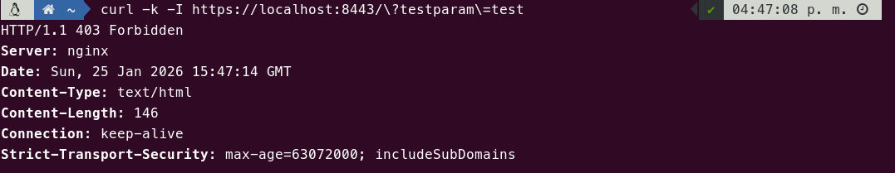
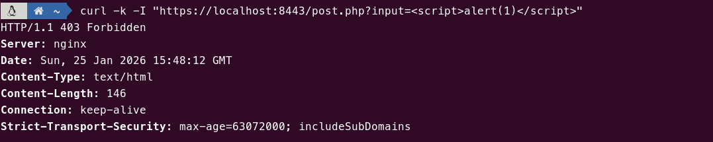
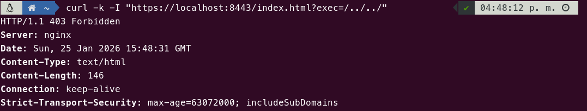
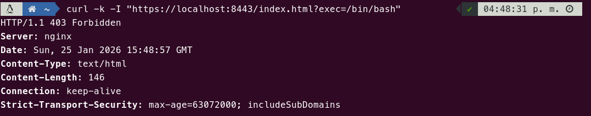
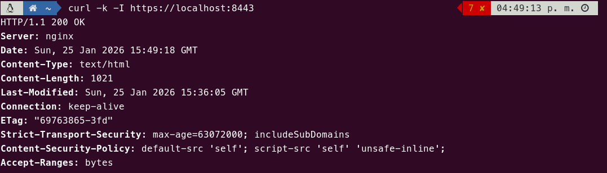
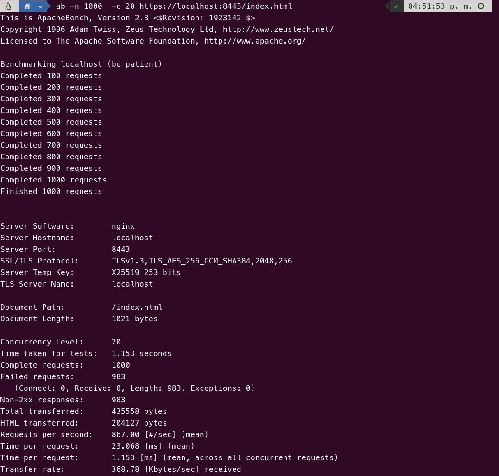
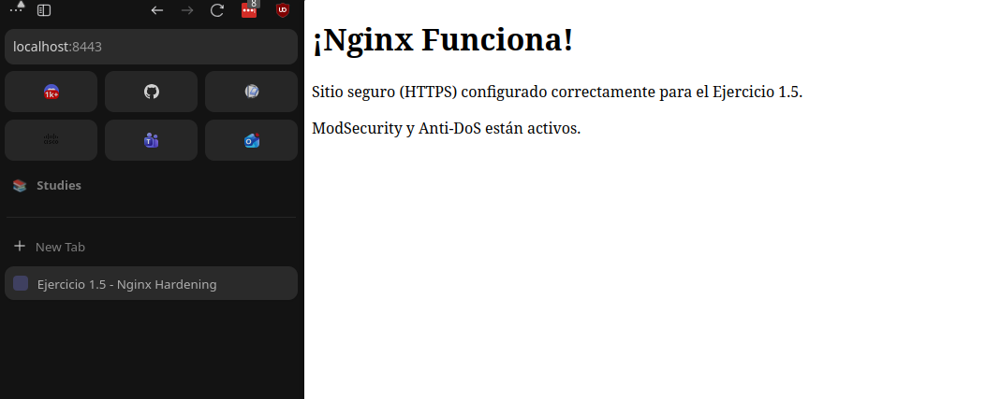

# Tarea 1.5

Esta tarea consiste en replicar las medidas de seguridad implementadas en las cuatro tareas anteriores (SSL, Hardening, WAF y Anti-DoS), pero utilizando **Nginx** como servidor web en lugar de Apache.

## Explicación

La configuración se ha migrado a Nginx en la medida de lo posible, manteniendo la funcionalidad de las tareas anteriores.

Primero se instala Nginx junto con `php-fpm` para dar soporte al script `post.php`. A diferencia de Apache, Nginx requiere un proceso externo (FastCGI) para ejecutar PHP.

```dockerfile
# Instalar Nginx, ModSecurity, PHP-FPM, Git y Curl
RUN apt-get update && \
    apt-get install -y nginx libnginx-mod-http-modsecurity php-fpm ssl-cert git curl ca-certificates && \
    apt-get clean
```


Al igual que con Apache, se descargan y configuran las reglas del WAF (OWASP CRS) y se configura el Anti-DoS.

```dockerfile
RUN rm -rf /usr/share/modsecurity-crs && \
    git clone https://github.com/SpiderLabs/owasp-modsecurity-crs.git /usr/share/modsecurity-crs

RUN mv /usr/share/modsecurity-crs/crs-setup.conf.example /usr/share/modsecurity-crs/crs-setup.conf
...
```

Con las reglas CSR preparadas, terminamos de configurar mod_security.

```dockerfile
RUN sed -i 's/SecRuleEngine DetectionOnly/SecRuleEngine On/' /etc/modsecurity/modsecurity.conf

RUN echo "Include /etc/modsecurity/modsecurity.conf" > /etc/nginx/modsec_includes.conf && \
    echo "Include /usr/share/modsecurity-crs/crs-setup.conf" >> /etc/nginx/modsec_includes.conf && \
    echo "Include /usr/share/modsecurity-crs/rules/*.conf" >> /etc/nginx/modsec_includes.conf
```
> Nota: La mayoría de las configuraciones se han realizado en el archivo `default.conf` de Nginx.
[Enlace al fichero `default.conf`](./default.conf)


Se copia nuestra configuración personalizada de Nginx y se eliminamos el default de nginx para evitar conflictos.
Se ha optado por introducir una redirección al sitio HTTPS en el puerto 8443, a fin de evitar la necesidad de configurar el puerto 80. Es la misma redirección que se configura en la práctica 2.

```dockerfile
COPY default.conf /etc/nginx/conf.d/default.conf
RUN rm /etc/nginx/sites-enabled/default
```

Por último, se copia el fichero post.php para probar las reglas WAF y se ejecuta el proceso de nginx en primer plano.

```dockerfile
COPY post.php /var/www/html/post.php
...
CMD ["sh", "-c", "service php8.3-fpm start && nginx -g 'daemon off;'"]
```


## Pull

```bash
docker pull pps11139483/pps-ra3:ra3_1-tarea-1.5
```

## Ejecución

```bash
docker run --name tarea1.5 -d -p 8443:443 pps11139483/pps-ra3:ra3_1-tarea-1.5
```

## Pruebas y validación


### Bloqueo por ejecución de parámetros bloqueados

**Comando:**

```bash
curl -k -I "https://localhost:8443/index.html?testparam=test"
```

**Resultado esperado:**

```bash
HTTP/1.1 403 Forbidden
```

### Bloqueo por inyección de scripts en POST

**Comando:**

```bash
curl -k -I "https://localhost:8443/post.php?input=<script>alert(1)</script>"
```

**Resultado esperado:**

```bash
HTTP/1.1 403 Forbidden`
```

### Bloqueo por intento de Path Traversal

**Comando:**

```bash
curl -k -I "https://localhost:8443/index.html?exec=/../../"
```

**Resultado esperado:**

```bash
HTTP/1.1 403 Forbidden
```

### Bloqueo de ejecución de comandos shell

**Comando:**

```bash
curl -k -I "https://localhost:8443/index.html?exec=/bin/bash"
```

**Resultado esperado:**

```bash
HTTP/1.1 403 Forbidden
```

### Inspección de cabeceras de seguridad
**Comando:**

```bash
curl -k -I https://localhost:8443/
```

**Resultado esperado:**

> Debe mostrar las cabeceras `Strict-Transport-Security` y `Content-Security-Policy`. La cabecera `Server` solo debe decir `nginx` sin mostrar la versión.

### Validación de Anti-DoS

**Comando:**

```bash
ab -n 1000 -c 20 https://localhost:8443/
```

**Resultado esperado:**

> Las primeras peticiones tendrán éxito, pero al superar el límite, el servidor empezará a devolver errores y la mayoría de periciones fallarán.

## Capturas

> Conexión **rechazada** con código de error `403` por la adición de parámetros bloqueados (la regla personalizada).


> Conexión **rechazada** con código de error `403` por bloqueo de inyección de comandos en POST.


> Conexión **rechazada** con código de error `403` por bloqueo de Path Traversal.


> Conexión **rechazada** con código de error `403` por bloqueo de ejecución de comandos shell.


> Curl al sitio **https** servidor Apache donde se muestran las **cabeceras de seguridad**.


> Ejecución de `ab`.

[**Descargar fichero con los logs completos de ejecución de ab**](./ab-logs.txt)

> Prueba de navegación por el sitio HTTPS.



## Fuentes

*   [Nginx Documentation - Rate Limiting](https://www.nginx.com/blog/rate-limiting-nginx/)
*   [OWASP Core Rule Set](https://coreruleset.org/)
*   [Linode - Asegurar Nginx con ModSecurity y OWASP CRS](https://www.linode.com/docs/guides/securing-nginx-with-modsecurity/?lang=es)
*   [Medium - Asegurando las cabeceras de respuestas HTTP en servidores web Apache y NGINX](https://medium.com/guayoyo/asegurando-las-cabeceras-de-respuestas-http-en-servidores-web-apache-y-nginx-2f71e62ffda4)
*   [AlexHost - Cómo prevenir ataques DDoS en Nginx mediante Hardening](https://alexhost.com/es/trust-and-security/how-to-prevent-ddos-attack-on-nginx/)