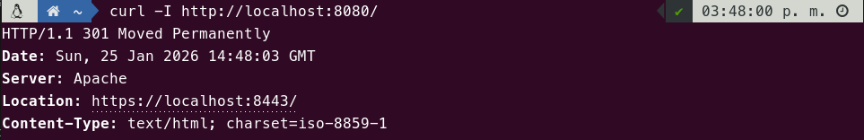
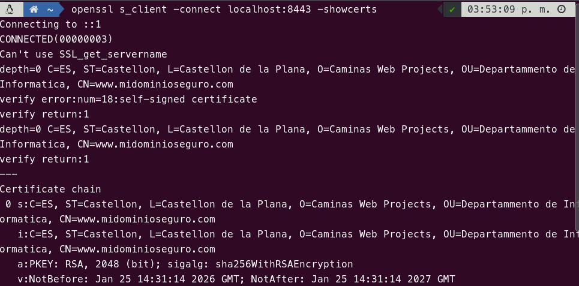
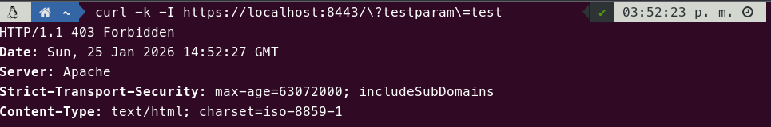
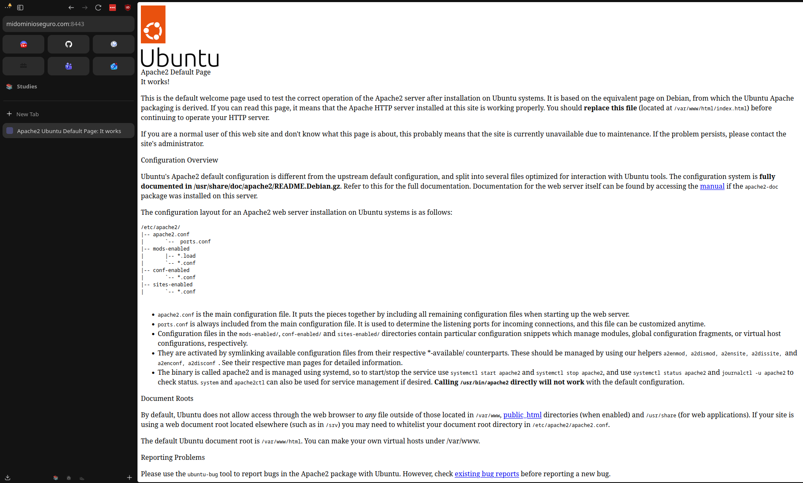

# Tarea 2

En esta tarea se profundiza en la configuración de la capa de transporte segura (TLS/SSL) en Apache, sustituyendo los certificados genéricos por uno personalizado y configurando la redirección automática de todo el tráfico inseguro (HTTP) hacia el canal seguro (HTTPS).

## Explicación

La solución se construye sobre la base de la **Tarea 1.4** (que ya incluye Hardening, WAF y Anti-DoS).

El primer paso consiste en la creación de un certificado autofirmado para Apache. Para ello, se utiliza el comando `openssl`.

```bash
RUN mkdir -p /etc/apache2/ssl && \
    openssl req -x509 -nodes -days 365 -newkey rsa:2048 \
    -keyout /etc/apache2/ssl/apache.key \
    -out /etc/apache2/ssl/apache.crt \
    -subj "/C=ES/ST=Castellon/L=Castellon de la Plana/O=Caminas Web Projects/OU=Departammento de Informatica/CN=www.midominioseguro.com"
```

> **Nota:** Se utiliza el flag `-subj` para evitar que openssl no haga preguntas o solicite confirmación.

El siguiente paso consiste en modificar el sitio default-ssl para que utilice los nuevos certificados que hemos generado. Esto se consigue con el comando `sed`.

```bash
RUN sed -i 's|/etc/ssl/certs/ssl-cert-snakeoil.pem|/etc/apache2/ssl/apache.crt|g' /etc/apache2/sites-available/default-ssl.conf && \
    sed -i 's|/etc/ssl/private/ssl-cert-snakeoil.key|/etc/apache2/ssl/apache.key|g' /etc/apache2/sites-available/default-ssl.conf
```

Ya por último aplicamos la redirección desde HTTP a HTTPS. Para lograrlo, hemos generado un nuevo fichero `000-default.conf` que copiamos sobre el anterior.

```xml
<VirtualHost *:80>
    ServerName localhost
    # Redirigimos al puerto https
    Redirect permanent / https://localhost:8443/
</VirtualHost>
```


Con estas modificaciones, Apache ya está listo para funcionar con nuestros certificados autofirmados, redirigiendo todo el tráfico inseguro (HTTP) hacia el canal seguro (HTTPS).

## Pull

```bash
docker pull pps11139483/pps-ra3:ra3_1-tarea-2
```

## Ejecución

```bash
docker run -d -p 8443:443 --name tarea2 pps11139483/pps-ra3:ra3_1-tarea-2
```

## Pruebas y validación

### 1. Validación de la Redirección (HTTP -> HTTPS)

**Comando:** 

```bash
curl -I http://localhost:8080/
```

**Resultado esperado:**

```bash
HTTP/1.1 301 Moved Permanently
```

### 2. Validación del Certificado Personalizado

**Comando:** 

```bash
openssl s_client -connect localhost:8443 -showcerts
```

**Resultado esperado:**

> En la sección "subject" del certificado, deben aparecer los datos personalizados (ej. `CN=www.midominioseguro.com`, `O=Caminas Web Projects`, `OU=Depatamento de Informatica`, etc.) en lugar de los datos de "Snakeoil".


### 3. Comprobación del WAF
Comprobamos que las medidas de hardening adoptadas en las anteriores prácticas siguen funcionando. Para ello probamos la regla personalizada que implantamos en el WAF con anterioridad.

**Comando:**

```bash
curl -k -I https://localhost:8443/?testparam=test`
```

**Resultado esperado:**

> Debe seguir devolviendo un `403 Forbidden`, demostrando que el WAF sigue operativo.

## Capturas

> Prueba de redirección HTTP a HTTPS.


> Inspección del certificado SSL.

[> **Descargar el output completo del comando**](./certinfo.txt)


> Comprobación de que el WAF sigue operativo.


> Prueba de navegación segura.



## Fuentes

*   [Apache Module mod_alias (Redirect)](https://httpd.apache.org/docs/2.4/mod/mod_alias.html#redirect)
*   [OpenSSL Command Line CSR Video](https://www.openssl.org/docs/manmaster/man1/openssl-req.html)
*   [DigitalOcean - How To Create a Self-Signed SSL Certificate for Apache](https://www.digitalocean.com/community/tutorials/how-to-create-a-self-signed-ssl-certificate-for-apache-in-ubuntu-16-04)
