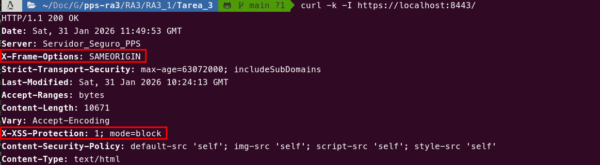
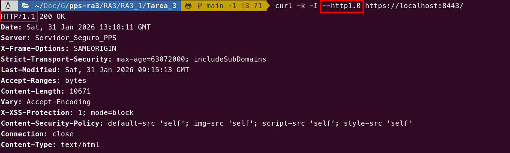
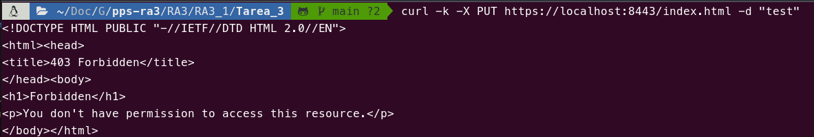
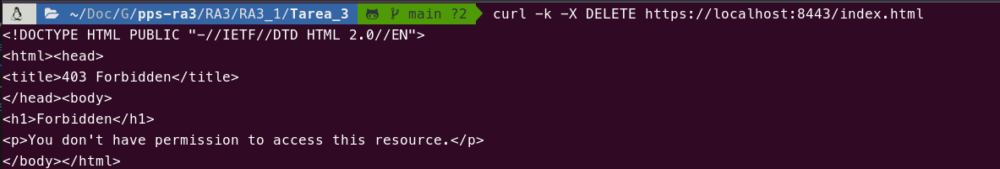
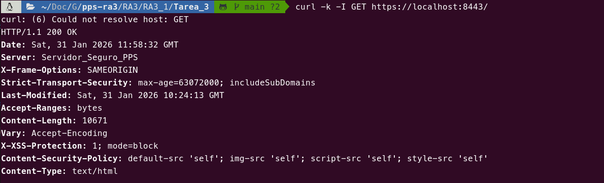
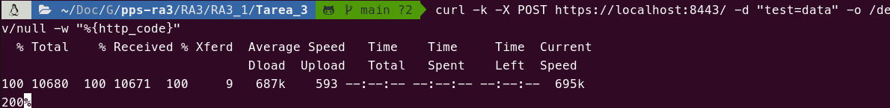
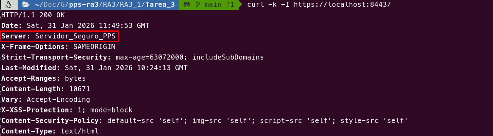
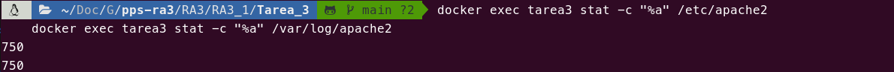
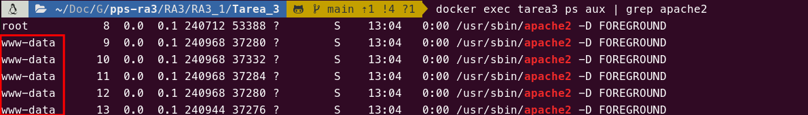

# Tarea 3

En esta tarea se han aplicado diversas medidas de **hardening** (fortalecimiento) en nuestro servidor Apache, basándonos en las recomendaciones de seguridad de la guía de Geekflare. Estas medidas buscan minimizar la superficie de ataque y proteger el servidor contra vulnerabilidades comunes.

## Explicación

Para comenzar, se ha configurado el servidor para restringir el acceso y la visibilidad de archivos críticos. Mediante la directiva `AllowOverride None`, deshabilitamos el uso de archivos `.htaccess`, lo que evita que configuraciones locales puedan saltarse las directivas de seguridad globales. Además, se desactivó el listado automático de directorios con `Options -Indexes` para que los usuarios no puedan ver la estructura de carpetas si no existe un archivo de índice, y se han eliminado los *Server Side Includes* con `-Includes` para reducir riesgos de ejecución de código.

```apache
# apache2.conf
<Directory /var/www/>
	Options -Indexes -Includes
	AllowOverride None
	Require all granted
</Directory>
```

Para evitar la fuga de información sensible, se han desactivado los **ETags** con la directiva `FileETag None`. Esto impide que el servidor revele atributos internos de los archivos, como el número de inodo, que podrían ser utilizados para deducir detalles del sistema de archivos.

```apache
# apache2.conf
FileETag None
```

En cuanto a la gestión de peticiones, se han restringido los métodos HTTP permitidos únicamente a **GET, POST y HEAD**. Al definir este límite en un archivo de configuración específico, bloqueamos métodos potencialmente peligrosos como `PUT`, `DELETE` o `CONNECT` que no son necesarios para el funcionamiento normal de la web.

```apache
# apache2.conf
<Directory "/var/www/html">
    <LimitExcept GET POST HEAD>
        deny from all
    </LimitExcept>
</Directory>
```

Asimismo, se ha deshabilitado explícitamente el método **TRACE** (`TraceEnable off`), protegiendo al servidor contra ataques de *Cross-Site Tracing* (XST) que intentan robar cookies de sesión HTTP.

```apache
# apache2.conf
TraceEnable off
```

Para fortalecer la seguridad en el navegador del usuario, se han inyectado varias **cabeceras de seguridad**. La cabecera `X-Frame-Options SAMEORIGIN` previene ataques de *Clickjacking* al prohibir que nuestro sitio sea embebido en iframes externos. Con `X-XSS-Protection`, activamos los filtros contra ataques XSS en navegadores antiguos, y mediante la edición de `Set-Cookie`, se asegura que todas las cookies se envíen con los flags `HttpOnly` (inaccesibles para scripts) y `Secure` (solo transmitidas por HTTPS).

```apache
# security-headers.conf
Header always append X-Frame-Options SAMEORIGIN
Header set X-XSS-Protection "1; mode=block"
Header edit Set-Cookie ^(.*)$ $1;HttpOnly;Secure
```

Para mitigar ataques de **Denegación de Servicio (DoS)** como *Slowloris*, se ha reducido el tiempo de `Timeout` a 60 segundos, forzando el cierre de conexiones inactivas más rápidamente y liberando recursos para otros usuarios legítimos.

```apache
# apache2.conf
Timeout 60
```

La seguridad de las comunicaciones se ha reforzado mediante el **Hardening de Ciphers SSL**. Se ha configurado el servidor para aceptar exclusivamente TLS 1.2 o superior, eliminando protocolos obsoletos, y se ha definido una suite de cifrado fuerte para evitar el uso de algoritmos vulnerables.

```apache
# default-ssl.conf
SSLProtocol all -SSLv2 -SSLv3 -TLSv1 -TLSv1.1 +TLSv1.2 +TLSv1.3
SSLCipherSuite HIGH:!aNULL:!MD5:!3DES
SSLHonorCipherOrder on
```

Una medida adicional de ofuscación ha sido camuflar el banner del servidor. Se ha configurado `ServerTokens Full` y se ha utilizado **ModSecurity** para modificar la firma del servidor a "Servidor_Seguro_PPS", dificultando el reconocimiento de la tecnología subyacente por parte de atacantes.

```apache
# apache2.conf
ServerTokens Full
```

```apache
# modsecurity.conf
SecServerSignature "Servidor_Seguro_PPS"
```

También se ha bloqueado el protocolo **HTTP 1.0**, obligando a todos los clientes a utilizar HTTP 1.1. Esto se consigue mediante reglas de reescritura que deniegan cualquier petición que no cumpla con esta versión del protocolo, asegurando que se beneficien de las mejoras de seguridad y rendimiento de las versiones más modernas.

```apache
# block-http10.conf
<IfModule mod_rewrite.c>
    RewriteEngine On
    RewriteCond %{THE_REQUEST} !HTTP/1\.1$
    RewriteRule .* - [F]
</IfModule>
```

Finalmente, se han aplicado principios de mínimos privilegios en los sistemas de archivos, restringiendo los **permisos de directorios** críticos. Al establecer el permiso `750` en las carpetas de configuración, binarios y logs, garantizamos que solo el propietario y su grupo tengan acceso controlado, protegiendo al sistema de accesos no autorizados por parte de otros usuarios locales.

```dockerfile
RUN chmod -R 750 /etc/apache2 /var/log/apache2 /usr/sbin/apache2
```

Para elevar aún más la seguridad, se ha configurado Apache para ejecutarse con un **usuario no privilegiado** creado específicamente para esta tarea (`apache:apache`). Al no utilizar el usuario por defecto del sistema (`www-data`), reducimos el impacto potencial en caso de que un atacante logre comprometer el proceso del servidor, limitando su capacidad de movimiento lateral dentro del contenedor.

```dockerfile
RUN groupadd apache && useradd -g apache apache
ENV APACHE_RUN_USER apache
ENV APACHE_RUN_GROUP apache
RUN chown -R apache:apache /var/www/html /var/log/apache2 /var/run/apache2 /var/lock/apache2
```

Siguiendo las mejores prácticas, se han deshabilitado módulos innecesarios como **WebDAV** (`mod_dav`, `mod_dav_fs`) y **mod_info**, que podrían ser vectores de ataque o fuga de información. Además, se ha personalizado el formato de los logs de acceso (`LogFormat`) para incluir el tiempo de respuesta (`%T`) y el ID de sesión (`%{sessionID}C`), mejorando la capacidad de auditoría y depuración.

```apache
# apache2.conf
LogFormat "%h %l %u %t \"%{sessionID}C\" \"%r\" %>s %b %T" common
```

Se ha habilitado el **Audit Log** de ModSecurity para registrar transacciones marcadas por las reglas. Esto se configura activando `SecAuditEngine` y definiendo la ruta del log con `SecAuditLog`.

```apache
# modsecurity.conf
SecAuditEngine On
SecAuditLog /var/log/apache2/modsec_audit.log
```

### Justificación: Configure Listen

La recomendación de configurar la directiva `Listen` con una IP absoluta (ej. `Listen 10.10.10.1:80`) **no se ha implementado** directamente en el archivo de configuración de Apache. En un entorno Docker, la gestión de IPs de escucha se delega al runtime de Docker. "Quemamos" una IP específica en la imagen haría que el contenedor fuera menos portable. La restricción de acceso por IP debe realizarse al ejecutar el contenedor (ej. `docker run -p 127.0.0.1:8080:80 ...`) o mediante firewalls externos.

### Justificación: Ejecutar todo como usuario `apache`

Ejecutar todo el contenedor como el usuario `apache` no es trivial: Apache necesita privilegios de arranque (bind a puertos <1024, crear PID/lock, leer configs) que normalmente realiza el proceso maestro como root y luego los workers bajan a un usuario no privilegiado; forzar todo a `apache` obliga a cambiar propietarios/permiso en `/etc/apache2`, `/var/run` y logs o a otorgar capacidades al binario, lo que reduce seguridad y portabilidad. Por eso la práctica recomendada es iniciar como root para preparar el entorno y dejar que los procesos worker ejecuten el trabajo con el usuario no privilegiado.

### Tabla resumen

| Tarea | Implementación |
| --- | --- |
| Remove Server Version Banner | apache2.conf, línea 8 |
| Disable directory browser listing | apache2.conf, línea 42 |
| Etag | apache2.conf, línea 6 |
| Run Apache from a non-privileged account | Dockerfile, líneas 47-49 |
| Protect binary and configuration directory permissions | Dockerfile, línea 45 |
| System Settings Protection | apache2.conf, línea 42 |
| HTTP Request Methods | limit-methods.conf |
| Disable Trace HTTP Request | apache2.conf, línea 7 |
| Set cookie with HttpOnly and Secure flag | security-headers.conf, línea 3 |
| Clickjacking Attack | security-headers.conf, línea 1 |
| Server Side Include | apache2.conf, línea 42 |
| X-XSS Protection | security-headers.conf, línea 2 |
| Disable HTTP 1.0 Protocol | block-http10.conf |
| Timeout value configuration | apache2.conf, línea 5 |
| SSL Key | Implementado en Tarea 2 |
| SSL Cipher | default-ssl.conf, líneas 41-42 |
| Disable SSL v2 & v3 | default-ssl.conf, línea 40 |
| ModSecurity | modsecurity.conf (lineas 1-2) |
| ModSecurity Logging | modsecurity.conf (líneas 50-52) |
| Change Server Banner | default-ssl.conf, línea 29 |
| Configure Listen Port | No aplica en Docker |
| Access Logging | apache2.conf, línea 11 |
| Disable Loading unwanted modules | Dockerfile, línea 41 |

## Pull

```bash
docker pull pps11139483/pps-ra3:ra3_1-tarea-3
```

## Ejecución

```bash
docker run -d -p 8443:443 --name tarea2 pps11139483/pps-ra3:ra3_1-tarea-3
```

## Pruebas y validación

### 1. Validar cabeceras de seguridad

**Comando:**

```bash
curl -k -I https://localhost:8443/
```

**Resultado esperado:**

```http
...
Strict-Transport-Security: max-age=63072000; includeSubDomains
Content-Security-Policy: default-src 'self'; img-src 'self'; script-src 'self'; style-src 'self'
X-Frame-Options: SAMEORIGIN
X-XSS-Protection: 1; mode=block
...
```

**Objetivo:** Verificar que todas las cabeceras de seguridad están presentes y correctamente configuradas.

---

### 2. Verificar bloqueo de HTTP 1.0

**Comando:**

```bash
curl -k -I --http1.0 https://localhost:8443/
```

**Resultado esperado:**

```bash
HTTP/1.1 200 OK
```

**Objetivo:** Asegurar que el servidor redirige conexiones HTTP 1.0 a HTTP 1.1.

---

### 3. Comprobar métodos HTTP bloqueados (PUT)

**Comando:**

```bash
curl -k -X PUT https://localhost:8443/index.html -d "test"
```

**Resultado esperado:**

```bash
HTTP/1.1 403 Forbidden
```

**Objetivo:** Verificar que métodos peligrosos como PUT están bloqueados por `limit-methods.conf`.

---

### 4. Comprobar métodos HTTP bloqueados (DELETE)

**Comando:**

```bash
curl -k -X DELETE https://localhost:8443/index.html
```

**Resultado esperado:**

```bash
HTTP/1.1 403 Forbidden
```

**Objetivo:** Verificar que el método DELETE también está correctamente bloqueado.

---

### 5. Validar GET permitido

**Comando:**

```bash
curl -k -I GET https://localhost:8443/
```

**Resultado esperado:**

```bash
HTTP/1.1 200 OK
```

**Objetivo:** Confirmar que GET funciona correctamente como método permitido.

---

### 6. Validar POST permitido

**Comando:**

```bash
curl -k -X POST https://localhost:8443/ -d "test=data" -o /dev/null -w "%{http_code}"
```

**Resultado esperado:**

```bash
200
```

**Objetivo:** Confirmar que POST funciona correctamente como método permitido.

---

### 7. Verificar server banner ofuscado

**Comando:**

```bash
curl -k -I https://localhost:8443/
```

**Resultado esperado:**

```
Server: Servidor_Seguro_PPS
```

**Objetivo:** Confirmar que la información del servidor está ofuscada para evitar reconocimiento de versión.

### 8. Verificar permisos de directorios
- **Comando:**

```bash
docker exec tarea3 stat -c "%a" /etc/apache2
docker exec tarea3 stat -c "%a" /var/log/apache2
```

**Resultado esperado:**

```text
En ambos casos:
750
```

### 9. Verificaciń de Apache ejecutándose con usuario no privilegiado:**

**Comando:**

```bash
docker exec tarea3 ps aux | grep apache | grep -v grep | grep -v "^root" | head -1
```

**Resultado esperado:**

```text
apache         7  0.0  0.0 240752 32360 ?        S    12:37   0:00 apache2 -D FOREGROUND
```

O cualquier otra línea donde Apache se ejecute bajo el usuario no privilegiado configurado (en este caso, "apache"). El proceso padre (PID 1) se ejecutará como root, pero los procesos workers deben ser bajo el usuario "apache".

## Capturas

> Verificación de las nuevas cabeceras de seguridad.<br>


> Forzado de HTTP/1.1.<br>


> Bloqueo de método PUT.<br>


> Bloqueo de método DELETE.<br>


> Verificación de método GET.<br>


> Verificación de método POST.<br>


> Verificación de ofuscación de banner.<br>


> Permisos de directorios.<br>


> Procesos worker de apache ejecutándose como usuario www-data.<br>


## Fuentes

*   [GeekFlare - Apache Web Server Hardening and Security Gudie](https://geekflare.com/cybersecurity/apache-web-server-hardening-security/)
